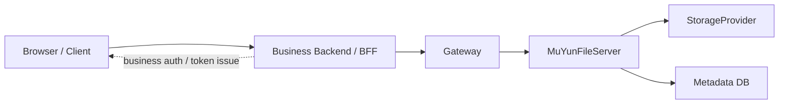
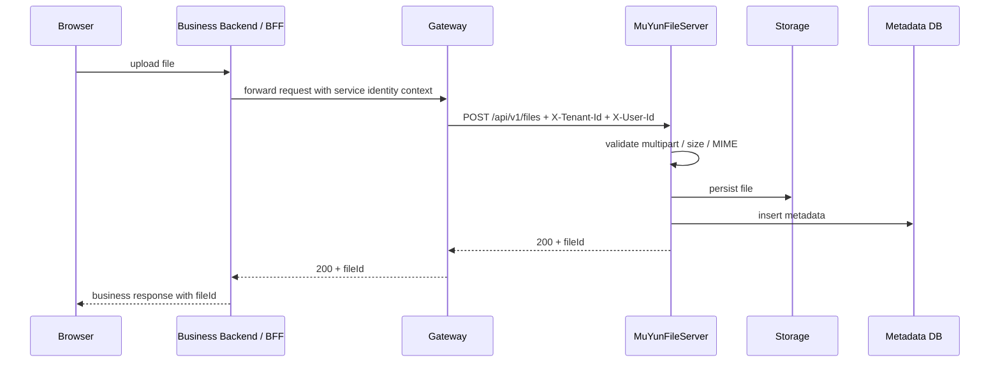
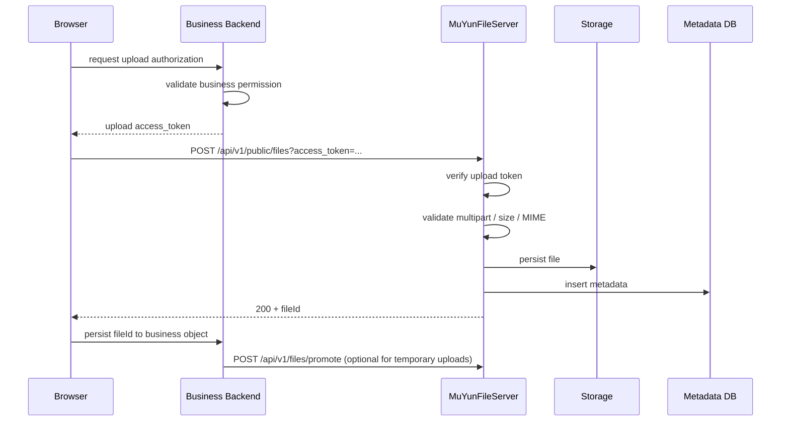
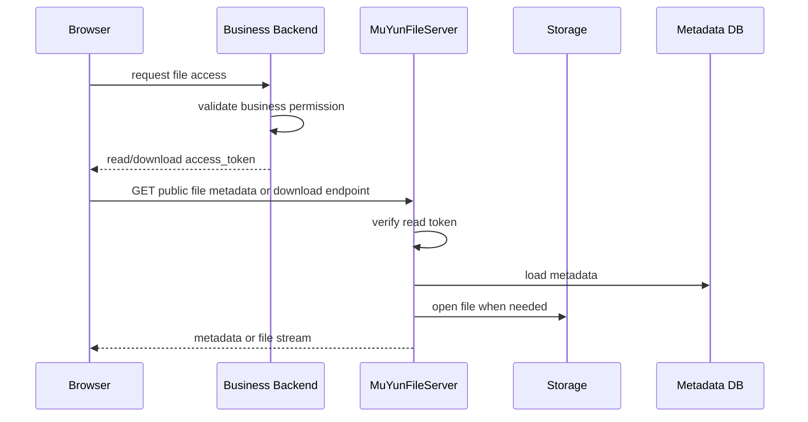
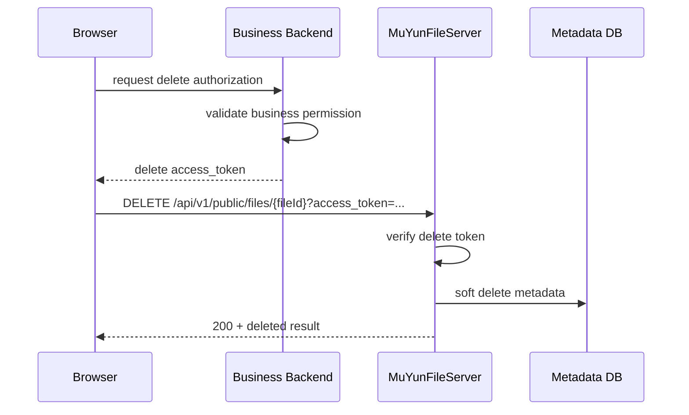

# MuYunFileServer Server Integration Guide

## 1. 文档目标

本文档面向业务后端、BFF、网关和平台接入方，说明 `MuYunFileServer` 的推荐接入方式、职责划分、数据流转和网关配合要求。

本文档不替代正式接口契约。具体字段、状态码和接口参数以 [API Design](./api.md) 为准。

---

## 2. 角色与职责

接入时通常涉及 5 个角色：

- 浏览器 / 客户端
- 业务后端 / BFF
- 统一网关
- `MuYunFileServer`
- 存储与元数据基础设施

职责划分如下：

| 角色 | 主要职责 |
|---|---|
| 浏览器 / 客户端 | 发起上传、查询、下载、删除请求，不直接持有可信身份头 |
| 业务后端 / BFF | 完成登录态和业务权限校验，决定是否签发短时 token |
| 统一网关 | 注入可信身份头，转发请求，处理跨域与响应头暴露 |
| `MuYunFileServer` | 校验租户、状态、token、MIME、大小限制并执行文件操作 |
| 存储 / 元数据库 | 保存文件二进制和文件元数据 |

核心原则：

- 业务权限由业务系统负责
- 文件级校验、租户隔离和文件状态控制由文件服务负责
- 浏览器前端不应直接携带 `X-Tenant-Id`、`X-User-Id`

---

## 3. 推荐接入拓扑



说明：

- 若使用可信身份头模式，请求主要经由网关转发到文件服务
- 若使用短时 token 模式，业务后端先完成业务授权，再把短时访问能力交给前端
- 即使使用 token 上传，文件流仍先进入 `MuYunFileServer`，不是对象存储直传

---

## 4. 两种接入模式

### 4.1 可信身份头模式

适合场景：

- 业务系统已有稳定的统一网关 / BFF
- 文件流量继续经过服务端转发可以接受
- 前端不需要直接持有文件服务短时地址

典型接口：

- `POST /api/v1/files`
- `GET /api/v1/files/{fileId}`
- `GET /api/v1/files/{fileId}/download`
- `DELETE /api/v1/files/{fileId}`

特点：

- 由网关或受控上游注入 `X-Tenant-Id`、`X-User-Id`
- 文件服务不负责认证，只信任上游身份上下文
- 业务后端通常自行保存 `fileId` 与业务对象的关系

### 4.2 短时 token 模式

适合场景：

- 前端需要直接访问文件服务
- 下载或上传流量不希望长期经过业务网关代理
- 业务系统希望把“是否允许这次文件操作”的授权结果显式下发给前端

典型接口：

- `POST /api/v1/public/files?access_token=...`
- `GET /api/v1/public/files/{fileId}?access_token=...`
- `GET /api/v1/public/files/{fileId}/download?access_token=...`
- `DELETE /api/v1/public/files/{fileId}?access_token=...`

特点：

- 公开接口不要求身份头
- 业务后端负责签发短时 token
- 文件服务只验证 token 与文件操作是否匹配
- 上传 token、读取 token、删除 token 必须分开签发

---

## 5. 典型数据流转

### 5.1 可信身份头上传



结果：

- `MuYunFileServer` 返回文件元数据摘要和 `fileId`
- 业务系统自行保存 `fileId` 与业务对象的关联

### 5.2 短时 token 上传



关键点：

- 上传 token 至少包含 `tenant_id`、`sub`、`purpose=upload`、`exp`
- token 上传支持多文件整单语义和 `remark`
- token 上传不支持 `file_ids`
- 若业务把上传结果仅作为草稿或中转文件，可先按临时文件使用，确认保留后再调用批量转正接口

### 5.3 短时 token 下载 / 查询



关键点：

- 读取 token 至少包含 `tenant_id`、`file_id`、`exp`
- 下载接口返回文件流，不是 JSON
- 文件已删除时，查询和下载都返回 `404`

### 5.4 短时 token 删除



关键点：

- 删除 token 必须包含 `purpose=delete`
- 删除成功后，同一文件的查询和下载都不可再访问

---

## 6. 服务端接入清单

接入方通常需要确认以下事项：

### 6.1 网关与头透传

- 可信身份头模式下，网关必须注入：
  - `X-Tenant-Id`
  - `X-User-Id`
- 可选透传：
  - `X-Request-Id`
  - `X-Client-Id`
- 浏览器侧不要直接构造上述身份头

### 6.2 token 签发要求

当前实现的 token 不是标准三段式 JWT，而是一个项目内约定的两段式签名串：

```text
base64url(payload-json-bytes) + "." + base64url(hmac_sha256_signature)
```

其中：

- `payload` 是 UTF-8 JSON 原文
- `signature` 是对 `payload` 原始字节做 `HMAC-SHA256`
- 签名密钥来自统一配置 `mfs.token.secret`
- 当前实现只支持算法值 `hmac-sha256`

生成步骤：

1. 业务后端组装 JSON payload
2. 用 UTF-8 编码得到 payload 原始字节
3. 使用共享密钥对 payload 原始字节执行 `HMAC-SHA256`
4. 将 payload 和 signature 分别做 base64url 编码
5. 用 `.` 拼接成最终 `access_token`

上传 token：

- 必须单独签发
- 至少包含 `tenant_id`、`sub`、`purpose=upload`、`exp`

示例：

```json
{
  "iss": "biz-app",
  "sub": "u123",
  "tenant_id": "tenant-a",
  "purpose": "upload",
  "exp": 1775188800
}
```

读取 token：

- 至少包含 `tenant_id`、`file_id`、`exp`

示例：

```json
{
  "iss": "biz-app",
  "sub": "u123",
  "tenant_id": "tenant-a",
  "file_id": "01JABCDEF1234567890ABCDEF",
  "exp": 1775188800
}
```

删除 token：

- 必须单独签发
- 至少包含 `tenant_id`、`file_id`、`purpose=delete`、`exp`

示例：

```json
{
  "iss": "biz-app",
  "sub": "u123",
  "tenant_id": "tenant-a",
  "file_id": "01JABCDEF1234567890ABCDEF",
  "purpose": "delete",
  "exp": 1775188800
}
```

### 6.3 业务系统保存的数据

业务系统通常只需要保存：

- `fileId`
- 自己的业务对象主键
- 可选的附件业务属性

文件服务当前不维护业务对象绑定关系。

### 6.4 错误处理建议

- 程序分支优先按 HTTP 状态码处理
- 不要依赖 `message` 作为稳定枚举值
- 建议记录 `request_id` 以便和服务端日志关联

### 6.5 跨域与下载响应头

若浏览器需要读取下载文件名或长度，网关应暴露：

- `Content-Disposition`
- `Content-Length`
- `Content-Type`

推荐网关设置：

```text
Access-Control-Expose-Headers: Content-Disposition, Content-Length, Content-Type
```

---

## 7. 什么时候选哪种模式

优先选可信身份头模式：

- 你已经有稳定的网关 / BFF 转发体系
- 文件流量继续经过服务端可接受
- 想减少 token 签发与管理复杂度

优先选短时 token 模式：

- 前端需要直接访问文件服务
- 希望把上传或下载流量从业务系统代理链路中剥离出来
- 需要把单次文件操作授权显式下发给前端

如果同一业务既有服务端上传，也有前端直传诉求，可以两种模式并存：

- 服务端场景继续走可信身份头模式
- 浏览器直连场景走短时 token 模式

---

## 8. 最小接入步骤

如果你是业务后端接入方，推荐按下面顺序落地：

### 8.1 可信身份头模式

1. 在网关或 BFF 中注入 `X-Tenant-Id`、`X-User-Id`
2. 调用 `POST /api/v1/files` 或其他可信身份头接口
3. 保存返回的 `fileId`
4. 在自己的业务表中维护 `fileId` 与业务对象的关联

### 8.2 短时 token 模式

1. 在业务后端完成登录态与业务权限校验
2. 根据操作类型签发对应 token：
   - 上传：`purpose=upload`
   - 读取：带 `file_id`
   - 删除：`purpose=delete`
3. 将短时 `access_token` 或完整公开 URL 返回给前端
4. 前端直接调用 `MuYunFileServer` 的公开接口
5. 业务后端按需保存 `fileId` 与业务对象的关系

---

## 9. 常见误区

- 不要把上传 token、读取 token、删除 token 混用。
- 不要假定 token 是标准 JWT；当前实现没有 JWT header 段。
- 不要让浏览器直接构造 `X-Tenant-Id`、`X-User-Id`。
- 不要依赖错误 `message` 做稳定的程序分支。
- 不要把 `fileId` 之外的存储细节暴露给业务系统或前端。
